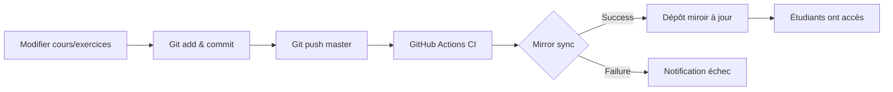

# Repository Mirroring Documentation

Ce système permet de synchroniser automatiquement ce dépôt (avec corrections) vers un dépôt miroir public (sans corrections) destiné aux étudiants.

## Vue d'ensemble

Le système de mirroring permet de :
- **Exclure les corrections** des exercices (répertoires `solution/`)
- **Exclure les fichiers de développement** (build artifacts, node_modules, etc.)
- **Exclure la documentation interne** (Specs/, TODO.md, QCM.md)
- **Inclure les workflows nécessaires** (marp-to-pages pour la publication du cours)
- **Synchroniser automatiquement** à chaque push sur `master`
- **Maintenir l'historique** avec des commits traçables

## Architecture

```
┌─────────────────────────────────┐
│  Dépôt Source (privé/prof)      │
│  - Cours + Exercices            │
│  - Solutions complètes          │
│  - Build scripts                │
└────────────┬────────────────────┘
             │ Push sur master
             ↓
      ┌──────────────┐
      │ GitHub CI    │
      │ mirror-sync  │
      └──────┬───────┘
             │ Exclut via
             │ .mirrorignore
             ↓
┌─────────────────────────────────┐
│  Dépôt Miroir (public/étudiant) │
│  - Cours + Exercices            │
│  - Fichiers starter uniquement  │
│  - Pas de solutions             │
└─────────────────────────────────┘
```

## Fichiers du système

### 1. `.mirrorignore`
Fichier de configuration définissant les exclusions spécifiques au mirroring.

**Syntaxe** : Identique à `.gitignore`

**Exemple** :
```
# Solutions des exercices
exercise-*/solution/
**/solution/

# Mirror management
.github/workflows/mirror-sync.yml
.github/SECRETS.example.md
scripts/mirror-sync.sh
scripts/test-mirror.sh
mirror.md
MIRROR.md
.mirrorignore

# Internal documentation
TODO.md
QCM.md
Specs/
.claude/
```

### 2. `scripts/mirror-sync.sh`
Script bash qui effectue la synchronisation.

**Fonctionnalités** :
- Clone le dépôt miroir
- Lit `.gitignore` et `.mirrorignore`
- Utilise `rsync` pour copier les fichiers en excluant les patterns
- Commit et push les changements

**Variables d'environnement requises** :
- `MIRROR_REPO_URL` : URL du dépôt miroir (SSH)
- `MIRROR_BRANCH` : Branche cible (défaut : `master`)

### 3. `.github/workflows/mirror-sync.yml`
Workflow GitHub Actions qui automatise la synchronisation.

**Déclenchement** :
- Push sur la branche `master`
- Déclenchement manuel via workflow_dispatch

## Configuration initiale

### Étape 1 : Créer le dépôt miroir

1. Créez un nouveau dépôt GitHub (ex: `terraform-training-students`)
2. **Important** : Le dépôt peut être public (destiné aux étudiants)
3. Initialisez-le avec un README ou laissez-le vide

### Étape 2 : Configurer les secrets GitHub

Dans les settings du dépôt source, ajoutez ces secrets :

#### `MIRROR_REPO_URL`
URL SSH du dépôt miroir
```
git@github.com:VOTRE_ORG/terraform-training-students.git
```

#### `MIRROR_SSH_KEY`
Clé SSH privée pour accéder au dépôt miroir

**Génération** :
```bash
# Générer une paire de clés ED25519
ssh-keygen -t ed25519 -C "mirror-bot@github-actions" -f mirror_key -N ""

# Afficher la clé privée (à copier dans le secret MIRROR_SSH_KEY)
cat mirror_key

# Afficher la clé publique (à ajouter comme Deploy Key)
cat mirror_key.pub
```

**Configuration dans GitHub** :
1. **Dépôt source** → Settings → Secrets → Actions
   - Ajoutez `MIRROR_SSH_KEY` avec le contenu de `mirror_key`
   - Ajoutez `MIRROR_REPO_URL` avec l'URL SSH du miroir

2. **Dépôt miroir** → Settings → Deploy keys
   - Ajoutez la clé publique (`mirror_key.pub`)
   - ✅ Cochez "Allow write access"

#### `MIRROR_BRANCH` (optionnel)
Branche cible dans le dépôt miroir (défaut : `master`)
```
main
```

### Étape 3 : Tester la synchronisation

#### Test manuel local

```bash
# Configurer les variables
export MIRROR_REPO_URL="git@github.com:VOTRE_ORG/terraform-training-students.git"
export MIRROR_BRANCH="master"

# Exécuter le script
./scripts/mirror-sync.sh
```

#### Test via GitHub Actions

1. Allez dans **Actions** → **Mirror Sync**
2. Cliquez sur **Run workflow**
3. Vérifiez les logs de l'exécution

### Étape 4 : Premier push

Une fois configuré, tout push sur `master` déclenchera automatiquement la synchronisation.

```bash
git add .
git commit -m "Update exercises"
git push origin master
# → La CI synchronise automatiquement vers le miroir
```

## Gestion des exclusions

### Ajouter une exclusion

Éditez `.mirrorignore` :
```bash
# Exemple : exclure tous les fichiers de test
**/test-*.txt

# Exemple : exclure un répertoire spécifique
internal-notes/
```

### Patterns courants

```gitignore
# Dossiers solution
exercise-*/solution/
**/solution/

# Fichiers de développement
*.local
.env*
TODO.md

# Artefacts de build
build/
dist/
*.log

# Répertoires spécifiques
private/
internal/
```

### Ordre de priorité

1. `.git/` est toujours exclu (automatique avec rsync)
2. Patterns dans `.gitignore` (fichiers non versionnés)
3. Patterns dans `.mirrorignore` (fichiers versionnés mais non mirrorés)

## Vérification de la synchronisation

### Vérifier localement ce qui sera synchronisé

```bash
# Simuler rsync en mode dry-run
rsync -avn --delete \
  --exclude-from=<(cat .gitignore .mirrorignore) \
  ./ /tmp/preview/
```

### Vérifier les différences entre source et miroir

```bash
# Cloner les deux dépôts
git clone git@github.com:VOUS/terraform-training.git source
git clone git@github.com:VOUS/terraform-training-students.git mirror

# Comparer
diff -r source mirror --exclude=.git
```

### Logs GitHub Actions

1. Allez dans **Actions** → **Mirror Sync**
2. Cliquez sur le dernier run
3. Examinez les logs détaillés

## Résolution de problèmes

### Erreur : "Permission denied (publickey)"

**Cause** : Clé SSH incorrecte ou non configurée

**Solution** :
1. Vérifiez que `MIRROR_SSH_KEY` contient la clé privée complète
2. Vérifiez que la clé publique est ajoutée comme Deploy Key avec write access

### Erreur : "No changes to sync"

**Cause** : Aucune modification détectée

**Solution** : C'est normal ! Le workflow ne commit que s'il y a des changements.

### Le dépôt miroir contient encore les solutions

**Cause** : Les patterns `.mirrorignore` ne matchent pas

**Solution** :
1. Vérifiez les patterns dans `.mirrorignore`
2. Testez localement avec rsync
3. Les fichiers déjà présents dans le miroir ne seront pas supprimés automatiquement

**Forcer le nettoyage** :
```bash
# Dans le dépôt miroir
git rm -r exercise-*/solution/
git commit -m "Remove solutions"
git push
```

### Le workflow ne se déclenche pas

**Cause** : Paths-ignore ou condition if empêche l'exécution

**Solution** :
1. Vérifiez que vous pushez sur `master`
2. Vérifiez que le commit ne modifie pas uniquement des fichiers ignorés
3. Essayez un déclenchement manuel (workflow_dispatch)

## Maintenance

### Mettre à jour les exclusions

```bash
# Éditer .mirrorignore
vim .mirrorignore

# Commit et push
git add .mirrorignore
git commit -m "Update mirror exclusions"
git push origin master
# → Synchronisation automatique avec nouvelles exclusions
```

### Désactiver temporairement la synchronisation

Deux options :

**Option 1** : Désactiver le workflow
- GitHub → Actions → Mirror Sync → ⋮ → Disable workflow

**Option 2** : Supprimer le secret
- Settings → Secrets → Supprimer `MIRROR_REPO_URL`

### Resynchroniser complètement

Si le dépôt miroir est désynchronisé :

```bash
# Option 1 : Via GitHub Actions
# Actions → Mirror Sync → Run workflow

# Option 2 : Localement
export MIRROR_REPO_URL="git@github.com:..."
./scripts/mirror-sync.sh
```

## Sécurité

### Bonnes pratiques

1. **Ne jamais commit de secrets** dans le dépôt source
2. **Utiliser des clés SSH dédiées** pour le mirroring
3. **Limiter les permissions** de la Deploy Key (write access sur miroir uniquement)
4. **Vérifier régulièrement** que les solutions ne fuient pas dans le miroir
5. **Auditer `.mirrorignore`** avant de pusher des données sensibles

### Que faire en cas de fuite ?

Si des solutions apparaissent dans le dépôt miroir :

1. **Supprimer immédiatement** :
   ```bash
   cd mirror-repo
   git rm -r exercise-*/solution/
   git commit -m "Emergency: Remove leaked solutions"
   git push --force
   ```

2. **Nettoyer l'historique** (si nécessaire) :
   ```bash
   git filter-branch --tree-filter 'rm -rf exercise-*/solution' HEAD
   git push --force
   ```

3. **Corriger `.mirrorignore`** pour éviter la récidive

4. **Notifier les étudiants** si nécessaire

## Workflow type



## Pour aller plus loin

- Ajouter des tests de validation (vérifier que solutions sont absentes)
- Créer des branches de release pour différentes cohortes
- Implémenter un système de versioning pour les exercices
- Automatiser la création de releases sur le dépôt miroir

## Support

En cas de problème :
1. Consultez les logs GitHub Actions
2. Testez le script localement
3. Vérifiez les secrets et permissions
4. Examinez les patterns d'exclusion
