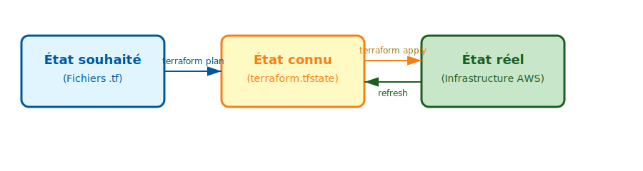

<style>
section::after {
    content: attr(data-marpit-pagination) '/' attr(data-marpit-pagination-total)
}
.highlight-red {
    color: red;
    font-weight: bold;
}
.highlight-blue {
    color: blue;
    font-weight: bold;
}
.highlight-green {
    color: green;
    font-weight: bold;
}
</style>

# Cours d'introduction à Terraform

IG2I - 2025 - Frédéric Triquet

---

<style scoped>
.columns {
  display: grid;
  grid-template-columns: 1fr 1fr;
  gap: 2rem;
}
</style>

## Table des matières

<div class="columns">
<div>

1. Introduction à l'Infrastructure en tant que Code
2. Qu'est-ce que Terraform ?
3. Approches traditionnelles vs Terraform
4. Terraform vs Ansible

</div>
<div>

5. Concepts fondamentaux
6. Flux de travail Terraform
7. Concepts avancés
8. Outils alternatifs

</div>
</div>

## Déroulement de la journée

  Cours puis TP, ce matin et cet après-midi

---

# 1. Introduction à l'Infrastructure en tant que Code

---

## Qu'est-ce que l'IaC ?

L'Infrastructure en tant que Code est la pratique de gestion et d'approvisionnement de l'infrastructure via des fichiers lisibles par la machine.

<!--
du code = des fichiers suffisamment simples pour être lus et écrits par l'Homme / suffisamment structurés pour être compris par la machine -->


### Avantages clés de l'IaC

- **"gitable"**
  - Contrôle de version pour suivre les modifications
  - Collaboration
- **Reproductible**
  - Environnements identiques
  - **Automatisation** : Réduction des erreurs humaines
- **Documentation** : Le code est source de documentation

---

## Évolution : Configuration manuelle

**Années 1990-2000**
- Pas de cloud
- Pas de virtualisation
- Pas de conteneurs
- Les infrastructures sont généralement de taille modeste
- Configuration manuelle via SSH/RDP
- Documentation dans des wikis → Risques de dérive et d'incohérence

<!-- les outils apparaissent avec les besoins
au début : infra simples

avant 2000 : il y a de la virtualisation mais pas pour faire de la prod

au fil des ans : augmentation de la puissance et baisse des coûts
 -->
---

## Évolution : Gestion de configuration

**Années 2000-2010**
- Pas de cloud
- Début de la virtualisation
- Pas de conteneurs
- La taille des infrastructures augmente
- Outils : Puppet, Chef, Ansible
- Automatisation de la configuration
- Focus sur la configuration logicielle

<!--
début de la virtu pour de la prod

-->
---

## Évolution : Infrastructure as Code

**Années 2010-aujourd'hui**
- Début du cloud
- Début des conteneurs
- Explosion de la taille des infrastructures et de la diversité de leurs composants
- Outils : Terraform, CloudFormation
- Cycle de vie complet de l'infrastructure

---

# 2. Qu'est-ce que Terraform ?

---

## Vue d'ensemble

**Terraform** est un outil d'_Infrastructure as Code_ open-source créé par HashiCorp.

Il permet de définir des ressources cloud et on-premise dans des fichiers de configuration lisibles.

---

## Caractéristiques clés

- **Langage déclaratif** : Description du résultat final attendu
- **Agnostique du cloud** : Un seul outil pour AWS, Azure, GCP, etc.
- **Gestion d'état** : L'état actuel de l'infrastructure est stocké dans une base de données
- **Planification** : Prévisualisation des modifications avant de les appliquer
- **Gestion des dépendances** : Résolution automatique

💡 _Gestion d'état, planification et dépendances seront vues en détail durant les exercices_

---

# 3. Approches traditionnelles vs Terraform

---

## Approche 1 : Configuration manuelle

**Créer une instance EC2 manuellement :**
1. Se connecter à la console AWS
2. Naviguer vers EC2
3. Cliquer sur "Launch Instance"
4. Configurer AMI, type, stockage, tags
5. Lancer et sauvegarder la clé

---

## Problèmes de l'approche manuelle

- ❌ Fastidieux (lourdeur des portails des cloud providers)
- ❌ Risque d'oubli d'un paramètre
- ❌ Difficile à reproduire
- ❌ Chronophage pour plusieurs ressources
- ❌ Pas de contrôle de version
- ❌ Connaissances dans la tête des gens
- ❌ Pas de piste d'audit

<!-- ---

## Solution Terraform

```hcl
resource "aws_instance" "web" {
  ami           = "ami-0c55b159cbfafe1f0"
  instance_type = "t2.micro"

  tags = {
    Name = "WebServer"
  }
}
``` -->
<!-- 
---

## Avantages Terraform

- ✅ Versionné dans Git
- ✅ Une commande : `terraform apply`
- ✅ Documenté dans le code
- ✅ Scalable (1 ou 100 instances)
- ✅ Outils qui analysent le code terraform
 -->
---

## Approche 2 : Scripts shell

```bash
#!/bin/bash
# Créer VPC
VPC_ID=$(aws ec2 create-vpc --cidr-block 10.0.0.0/16 \
  --query 'Vpc.VpcId' --output text)

# Créer Subnet
SUBNET_ID=$(aws ec2 create-subnet --vpc-id $VPC_ID \
  --cidr-block 10.0.1.0/24 --output text)

# Créer instance
aws ec2 run-instances --image-id ami-xxx \
  --instance-type t2.micro --subnet-id $SUBNET_ID
```

---

## Problèmes des scripts shell

- ❌ Modèle **Impératif** : Il faut spécifier chaque étape
- ❌ Pas de gestion des dépendances : **dans le bon ordre**
- ❌ Pas de gestion d'état : Une ré-exécution crée des doublons
- ❌ Gestion d'erreurs complexe : Mon script échoue à la ligne 700... 😱😱😱
- ❌ Pas de dry-run

---

## Solution Terraform (déclarative)

```hcl
resource "aws_vpc" "main" {
  cidr_block = "10.0.0.0/16"
}

resource "aws_subnet" "public" {
  vpc_id     = aws_vpc.main.id
  cidr_block = "10.0.1.0/24"
}

resource "aws_instance" "web" {
  ami           = "ami-0c55b159cbfafe1f0"
  instance_type = "t2.micro"
  subnet_id     = aws_subnet.public.id
}
```

---

## Avantages de Terraform

- ✅ Modèle **Déclaratif** : décrire l'état souhaité
- ✅ Résolution automatique des dépendances : l'ordre n'importe pas
- ✅ Gestion d'état : il sait ce qui existe
- ✅ Idempotent : on peut l'exécuter plusieurs fois sans problème
- ✅ Mises à jour et suppressions faciles
- ✅ Versionné dans Git
- ✅ Une commande : `terraform apply`
- ✅ Documenté dans le code
- ✅ Scalable (1 ou 100 instances)
- ✅ Outils qui analysent le code terraform

---

## Approche 3 : Outils cloud-spécifiques

**CloudFormation (AWS), ARM Templates (Azure)**

**Problèmes :**
- ❌ Verrouillage fournisseur
- ❌ Limité à un seul cloud
- ❌ Syntaxe JSON/YAML complexe

---

# 4. Terraform vs Ansible

<!--
on parle souvent de ces 2 outils
on peut les confondre (quand on ne les connaît pas bien)

points communs : IaC, HashiCorp
-->
---

## Différences clés

|              | Ansible                   | Terraform                              |
| ------------ | ------------------------- | -------------------------------------- |
| **Objectif** | Configuration de serveurs | Provisionnement de ressources          |
| **Langage**  | YAML                      | HCL (Hashicorp Configuration Language) |
| **État**     | Sans état                 | Avec état                              |
| **Approche** | Push (SSH)                | API-based                              |

⚠️ Il y a des actions réalisables avec les deux outils

---

## Exemple : Ansible

```yaml
- name: Provision EC2 instance
  hosts: localhost
  tasks:
    - name: Create EC2 instance
      ec2:
        key_name: mykey
        instance_type: t2.micro
        image: ami-0c55b159cbfafe1f0
        region: us-east-1
```

---

## Exemple : Terraform

```hcl
resource "aws_instance" "web" {
  ami           = "ami-0c55b159cbfafe1f0"
  instance_type = "t2.micro"
  key_name      = "mykey"

  tags = {
    Name = "WebServer"
  }
}

output "instance_ip" {
  value = aws_instance.web.public_ip
}
```

---

<style scoped>
.columns {
  display: grid;
  grid-template-columns: 1fr 1fr;
  gap: 0rem;
}
</style>

## Quand utiliser quoi ?

<div class="columns">
<div>

### Quand utiliser Terraform ?

- Création d'infrastructure cloud
- Gestion du cycle de vie (créer, modifier, détruire) de ressources cloud
- Modules d'infrastructure réutilisables

➡️ De quelle infrastructure ai-je besoin ?

</div>
<div>

### Quand utiliser Ansible ?

- Configuration de logiciels sur serveurs existants
- Déploiement d'applications
- Commandes ad-hoc
- Gestion de fichiers de configuration
- Orchestration multi-étapes

➡️ Comment configurer ces serveurs ?

</div>
</div>

---

## Utilisez les deux ensemble !

```
Terraform → Créer l'infrastructure
  ├─ Instances EC2
  ├─ RDS
  └─ Load balancer
     ↓
Ansible → Configurer l'infrastructure
  ├─ Installer logiciels
  ├─ Configurer applications
  └─ Déployer le code
```

---

## Workflow combiné

```bash
# 1. Créer l'infrastructure
terraform apply

# 2. Obtenir les IPs
terraform output -json > inventory.json

# 3. Configurer les serveurs
ansible-playbook -i inventory.json configure.yml
```

- ⚠️ les outputs doivent être adaptés ⚠️
- l'utilisation de l'inventaire automatique est quand même préférable

---

# 5. Concepts fondamentaux

---

## Providers (Fournisseurs)

Les providers sont des plugins permettant à Terraform d'interagir avec les APIs.

```hcl
provider "aws" {
  region = "us-east-1"
}

provider "google" {
  project = "my-gcp-project"
  region  = "us-central1"
}
```

---

## Providers populaires

- **Cloud** : AWS, Azure, Google Cloud
- **Conteneurs** : Kubernetes, Docker
- **DevOps** : GitHub, GitLab
- **Monitoring** : Datadog, PagerDuty
- **Et plus de 2000 autres !**

---

## Resources (Ressources)

Les ressources sont l'élément central de Terraform.
Elles sont fournies par les providers.
1 ressource $\approx$ 1 élément d'infrastructure
**Syntaxe :**

<pre>resource "<span class="highlight-red">TYPE_RESSOURCE</span>" "<span class="highlight-blue">NOM</span>" {
  argument1 = valeur1
  argument2 = valeur2
}</pre>

---

## Exemple de ressource

<pre>
resource "<span class="highlight-red">aws_instance</span>" "<span class="highlight-blue">web</span>" {
  ami           = "ami-0c55b159cbfafe1f0"
  instance_type = "t2.micro"

  tags = {
    Name = "MyWebServer"
  }
}

# Référencer une autre ressource
resource "aws_eip" "web_ip" {
  instance = <span class="highlight-red">aws_instance</span>.<span class="highlight-blue">web</span>.id
}
</pre>

---

## Data Sources (Sources de données)

Récupérer et utiliser des informations sur des ressources existantes.

<pre>
<span class="highlight-green">data</span> "<span class="highlight-red">aws_ami</span>" "<span class="highlight-blue">amazon_linux</span>" {
  most_recent = true
  owners      = ["amazon"]

  filter {
    name   = "name"
    values = ["amzn2-ami-hvm-*"]
  }
}

resource "aws_instance" "web" {
  ami = <span class="highlight-green">data</span>.<span class="highlight-red">aws_ami</span>.<span class="highlight-blue">amazon_linux</span>.id
  instance_type = "t2.micro"
}
</pre>

---

## Variables

Rendre les configurations réutilisables.

```hcl
variable "instance_type" {
  description = "Type d'instance EC2"
  type        = string
  default     = "t2.micro"
}

variable "environment" {
  description = "Nom de l'environnement"
  type        = string
}
```

---

## Utilisation des variables

```hcl
resource "aws_instance" "web" {
  ami           = "ami-0c55b159cbfafe1f0"
  instance_type = var.instance_type

  tags = {
    Name        = "web-${var.environment}"
    Environment = var.environment
  }
}
```

---

## Passer des variables

**Ligne de commande :**
```bash
terraform apply \
  -var="instance_type=t2.small" \
  -var="environment=prod"
```

**Fichier terraform.tfvars :**
```hcl
instance_type = "t2.small"
environment   = "prod"
```

---

## Outputs (Sorties)

Afficher des informations après l'exécution.

```hcl
output "instance_ip" {
  description = "IP publique"
  value       = aws_instance.web.public_ip
}

output "instance_id" {
  value = aws_instance.web.id
}
```

## Utilisation des outputs

```bash
$ terraform output
instance_ip = "54.123.45.67"
instance_id = "i-0abcd1234efgh5678"
```

---

## State (État)

Le fichier `terraform.tfstate` est la base de données de Terraform :
- IDs des ressources
- Configuration actuelle
- Métadonnées et dépendances

Terraform :
- Le tient à jour
- Sait exactement ce qui existe
- Compare facilement le code et le _state_ : planification rapide

⛔ Ne pas modifier l'infrastructure par un autre moyen

⛔ Ne pas modifier le _state_ soi-même

---

## Emplacements du State

- **Local** : Sur votre machine (défaut)
- **Distant** : S3, Terraform Cloud (recommandé)

```hcl
terraform {
  backend "s3" {
    bucket = "my-terraform-state"
    key    = "prod/terraform.tfstate"
    region = "us-east-1"
  }
}
```
⚠️ il faut créer ce bucket **avant** d'utiliser terraform ⚠️

---

## Sécurité du State

⚠️ **Considérations importantes :**
- Contient des données sensibles - sécurisez-le !
- Ne jamais l'éditer manuellement
- Utiliser l'état distant pour la collaboration
- Activer le verrouillage d'état

<!--
sur AWS le state locking se fait avec une base dynamoDB,
sur Azure le blob storage le gère tout seul, idem chez GCP
-->

---

## Idempotence

Exécuter plusieurs fois `terraform apply` → même résultat final

```bash
$ terraform apply  # Crée 1 instance
$ terraform apply  # Aucun changement
$ terraform apply  # Aucun changement
```

**Comment ça marche :**
1. Lire l'état souhaité (`.tf`)
2. Lire l'état actuel (`.tfstate`)
3. Appliquer uniquement les différences

---

# TP

---

## Un point sur l'organisation des fichiers

- Seule l'extension est vraiment importante (`.tf`)
- Il n'y a pas d'ordre à respecter (puisque c'est **déclaratif**)
- Terraform lit tous les fichiers du répertoire courant, retrouve les providers déclarés, les définitions de variables, les `locals`, les ressources, les outputs, et construit un arbre de dépendances pour savoir dans quel ordre il faut procéder
- **Conclusion:** on peut tout écrire dans 1 seul fichier `.tf`, **mais** on préférera répartir les éléments dans des fichiers avec des noms qui ont du sens

---

## Les trois états dans Terraform



- **État souhaité** : Ce que vous écrivez dans vos fichiers `.tf`
- **État connu** : Ce que Terraform a enregistré dans `.tfstate`
- **État réel** : Ce qui existe réellement dans l'infrastructure

---

# 6. Flux de travail Terraform

---

## Commandes de base

```
terraform init      # Initialiser
terraform fmt       # Formater
terraform validate  # Valider
terraform plan      # Voir changements
terraform apply     # Appliquer
terraform output    # Voir outputs
terraform destroy   # Détruire
```

---

## Workflow Terraform

```
Code Terraform (.tf)
       ↓
terraform init
       ↓
terraform plan
       ↓
terraform apply
       ↓
Ressources réelles
```

---

## terraform init
- Initialise un répertoire de travail, installe les providers et modules.
- Première fois dans un projet
- Après l'ajout de providers/modules

---

## terraform plan

Crée un plan d'exécution.

**Symboles :**
- `+` : Ressource créée
- `-` : Ressource détruite
- `~` : Ressource modifiée
- `-/+` : Ressource remplacée

---

## Exemple de sortie de plan

```
Terraform will perform the following actions:

  # aws_instance.web will be created
  + resource "aws_instance" "web" {
      + ami           = "ami-0c55b159cbfafe1f0"
      + instance_type = "t2.micro"
      + id            = (known after apply)
    }

Plan: 1 to add, 0 to change, 0 to destroy.
```

---

### terraform apply

Applique les changements.

```bash
# Auto-approuver
terraform apply -auto-approve

# Avec variables
terraform apply -var="instance_type=t2.small"
```

### terraform destroy

Détruit toutes les ressources gérées.

```bash
# Détruire une ressource spécifique
terraform destroy -target=aws_instance.web
```

---

## Commandes utilitaires

### terraform fmt

Formater le code.

```bash
terraform fmt              # Formater
terraform fmt -check       # Vérifier
terraform fmt -recursive   # Récursif
```

### terraform validate

Valider la syntaxe.


---

## Commandes d'état

```bash
# Lister les ressources
terraform state list

# Afficher une ressource
terraform state show aws_instance.web

# Retirer de l'état
terraform state rm aws_instance.web

# Renommer
terraform state mv aws_instance.old aws_instance.new
```

<!--
le state mv sert quand on renomme une ressource dans le code tf
-->

---

## Autres commandes utiles

```bash
# Afficher l'état actuel
terraform show

# Sync avec l'infra réelle
terraform refresh

# Créer un graphe
terraform graph | dot -Tpng > graph.png
```

---

# 7. Concepts avancés

  Modules, locals, count, for_each, ...

---

## Modules

Conteneurs pour plusieurs ressources utilisées ensemble.

**Structure :**
```
modules/
  └── vpc/
      ├── main.tf
      ├── variables.tf
      └── outputs.tf
```

---

## Définition de module

```hcl
resource "aws_vpc" "main" {
  cidr_block = var.vpc_cidr

  tags = {
    Name = var.vpc_name
  }
}

resource "aws_subnet" "public" {
  vpc_id     = aws_vpc.main.id
  cidr_block = var.public_subnet_cidr
}
```

---

## Utilisation du module

```hcl
module "vpc" {
  source = "./modules/vpc"

  vpc_name           = "production-vpc"
  vpc_cidr           = "10.0.0.0/16"
  public_subnet_cidr = "10.0.1.0/24"
}

resource "aws_instance" "web" {
  subnet_id = module.vpc.public_subnet_id
}
```

---

## Avantages des modules

- ✅ Réutilisabilité du code
- ✅ Organisation
- ✅ Encapsulation
- ✅ Contrôle de version des composants

---

## Locals

Valeurs locales pour la réutilisation.

```hcl
locals {
  common_tags = {
    Environment = "Production"
    ManagedBy   = "Terraform"
  }
  instance_name = "${var.project}-${var.env}-web"
}

resource "aws_instance" "web" {
  tags = merge(local.common_tags, {
    Name = local.instance_name
  })
}
```

---

## Variables vs Locals : Quelle différence ?

|  | **Variables** (`var.*`) | **Locals** (`local.*`) |
|--------|-------------------------|------------------------|
| **Nature** | Entrées configurables | Valeurs calculées internes |
| **Source** | Fournies par l'utilisateur | Dérivées de variables/ressources |
| **Modification** | Peut changer entre exécutions | Calculée à chaque exécution |
| **Usage** | Paramètres d'entrée | Éviter la répétition de calculs |


- Utilisez **variables** pour ce qui vient de l'extérieur
- Utilisez **locals** pour ce qui est calculé/transformé en interne

---

<style scoped>
.columns {
  display: grid;
  grid-template-columns: 1fr 1fr;
  gap: 2rem;
}
</style>

## Exemple : Variables vs Locals

<div class="columns">
<div>

```hcl
# Variables : entrées utilisateur
variable "environment" {
  type = string
}

variable "project" {
  type = string
}

# Locals : valeurs calculées
locals {
  # Évite de répéter cette construction partout
  name_prefix = "${var.project}-${var.environment}"

  # Tags communs dérivés des variables
  common_tags = {
    Project     = var.project
    Environment = var.environment
    ManagedBy   = "Terraform"
    CreatedAt   = timestamp()
  }
}
```
</div>
<div>

```hcl
# Utilisation
resource "aws_s3_bucket" "data" {
  bucket = "${local.name_prefix}-data"
  tags   = local.common_tags
}

resource "aws_s3_bucket" "logs" {
  bucket = "${local.name_prefix}-logs"
  tags   = local.common_tags
}
```
</div>
</div>

---

## Count

```hcl
resource "aws_instance" "server" {
  count         = 3
  ami           = var.ami_id
  instance_type = "t2.micro"

  tags = {
    Name = "server-${count.index}"
  }
}
```

---

## for_each

```hcl
variable "instances" {
  default = {
    web = { instance_type = "t2.micro" }
    api = { instance_type = "t2.small" }
  }
}

resource "aws_instance" "server" {
  for_each      = var.instances
  ami           = var.ami_id
  instance_type = each.value.instance_type

  tags = { Name = each.key }
}
```

---

## Expressions conditionnelles

```hcl
resource "aws_instance" "web" {
  ami = var.ami_id
  instance_type = var.environment == "production" ? \
                  "t2.large" : "t2.micro"

  tags = {
    Name = var.environment == "production" ? \
           "prod-web" : "dev-web"
  }
}
```

---

## Blocs dynamiques : Variable

```hcl
variable "ingress_rules" {
  type = list(object({
    port        = number
    cidr_blocks = list(string)
  }))
  default = [
    { port = 80,  cidr_blocks = ["0.0.0.0/0"] },
    { port = 443, cidr_blocks = ["0.0.0.0/0"] }
  ]
}
```

---

## Blocs dynamiques : Utilisation

```hcl
resource "aws_security_group" "web" {
  name = "web-sg"

  dynamic "ingress" {
    for_each = var.ingress_rules
    content {
      from_port   = ingress.value.port
      to_port     = ingress.value.port
      protocol    = "tcp"
      cidr_blocks = ingress.value.cidr_blocks
    }
  }
}
```

---

## Workspaces : Commandes

Gérer plusieurs environnements.

```bash
# Lister
terraform workspace list

# Créer et basculer
terraform workspace new dev
terraform workspace new prod

# Basculer
terraform workspace select dev
```

---

## Workspaces : Utilisation

```hcl
resource "aws_instance" "web" {
  ami = var.ami_id
  instance_type = terraform.workspace == "prod" ? \
                  "t2.large" : "t2.micro"

  tags = {
    Name        = "web-${terraform.workspace}"
    Environment = terraform.workspace
  }
}
```

---

## Remote State Data Source

Partager des données entre projets Terraform distincts mais dépendants.

**Cas d'usage :**
- Projet A : infrastructure réseau (VPC, subnets)
- Projets B, C, D : applications qui utilisent ce réseau

---

## Exemple : Remote State avec S3

**Projet A** (stocke son state dans S3)

```hcl
# Configuration du backend S3 pour stocker le state
terraform {
  backend "s3" {
    bucket = "mon-bucket-terraform-state"
    key    = "network/terraform.tfstate"
    region = "eu-west-3"
  }
}

# Création du VPC
resource "aws_vpc" "main" { cidr_block = "10.0.0.0/16" ; tags = { Name = "vpc-principal" } }

resource "aws_subnet" "public" {
  vpc_id = aws_vpc.main.id ; cidr_block = "10.0.1.0/24" ; tags = { Name = "subnet-public" }
}

# Exporter les valeurs pour les autres projets
output "vpc_id" { value = aws_vpc.main.id }

output "subnet_id" { value = aws_subnet.public.id }
```

---

**Projet B** (lit le state de A)

```hcl
# Lire le state du projet A depuis S3
data "terraform_remote_state" "network" {
  backend = "s3"
  config = {
    bucket = "mon-bucket-terraform-state"
    key    = "network/terraform.tfstate"
    region = "eu-west-3"
  }
}

# Utiliser les outputs du projet A
resource "aws_instance" "web" {
  ami           = "ami-12345678"
  instance_type = "t2.micro"

  # Utilisation du subnet_id exporté par le projet A
  subnet_id = data.terraform_remote_state.network.outputs.subnet_id

  tags = {
    Name = "serveur-web"
    VPC  = data.terraform_remote_state.network.outputs.vpc_id
  }
}

```

---

# 8. Outils alternatifs

---

## OpenTofu

Fork open-source de Terraform créé suite au changement de licence de Terraform.

**Points clés :**
- 100% compatible avec Terraform
- Même syntaxe HCL
- Géré par la communauté
- Vraiment open source

🔍 En fait le changement de licence impacte peu de monde et ne concerne que les entreprises qui vendent une solution d'infrastructure ou de gestion de cloud intégrant Terraform. Quelques sociétés concernées : Pulumi, Spacelift, Scalr, Aiven

---

## Ressources

- **Documentation** : terraform.io/docs
- **Terraform Registry** : registry.terraform.io
- **Provider AWS** : registry.terraform.io/providers/hashicorp/aws
- **HashiCorp Learn** : learn.hashicorp.com
- **Communauté** : discuss.hashicorp.com

